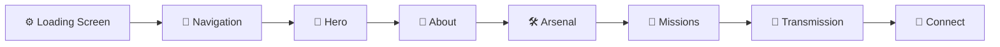
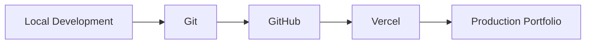

# ⚙️ Optimus Prime — Developer Portfolio

> **A cinematic, interactive developer portfolio inspired by futuristic mechanical systems, built to showcase my projects, skills, and journey into software engineering.**

[](https://react.dev/)
[](https://www.typescriptlang.org/)
[](https://vite.dev/)
[](https://tailwindcss.com/)
[](https://gsap.com/)
[](https://github.com/)

---

## 🚀 Overview

This repository contains my personal developer portfolio — a **single-page, scroll-based frontend experience** designed to be more than a traditional collection of cards and links.

Instead of building a conventional portfolio, I wanted to experiment with the idea of treating the website like an interactive system.

The visual direction combines:

- Futuristic mechanical interfaces
- Industrial HUD elements
- Dark obsidian backgrounds
- Gunmetal surfaces
- Oxblood accents
- Cyan interface highlights
- Scroll-driven motion
- Interactive image effects
- Cinematic loading sequences
- Responsive layouts

The result is a portfolio that combines **personal branding with frontend engineering**.

---

# 🎯 Why I Built This

I wanted to build something that would challenge me beyond simply creating another website.

The project gives me an opportunity to explore modern frontend concepts by actually implementing them in a real application.

Rather than learning every technology in isolation, the goal is to learn concepts while building something tangible:

> **Learn → Build → Break → Debug → Understand → Ship**

This project is therefore both a portfolio and a learning project.

---

# 🧠 What This Project Focuses On

The portfolio specifically explores:

- React component architecture
- TypeScript interfaces and props
- State management
- DOM references with TypeScript
- Responsive layouts
- Tailwind CSS
- CSS custom properties
- `clip-path` masking
- GSAP timelines
- GSAP staggered animations
- GSAP ScrollTrigger
- Smooth cursor-following interactions
- Responsive design
- Accessibility
- Reduced-motion support
- Frontend performance
- Production deployment

The implementation is intentionally structured around reusable components rather than putting the entire website into one large file.

---

# 🗺️ Experience Flow

The portfolio is designed as a single scrolling experience.



The main idea is simple:

**Introduce → Explain → Showcase → Connect**

---

# ✨ Core Features

## ⚙️ Cinematic Loading Screen

The portfolio begins with a short mechanical assembly sequence.

Small interface panels animate into position while a progress indicator moves from `0%` to `100%`.

The animation is built using a GSAP timeline so that individual elements can be:

- Sequenced
- Staggered
- Randomized
- Overlapped
- Timed precisely

The goal is to make the transition feel like a system booting up rather than a generic website loader.

---

## 🧭 Interactive Navigation

The navigation stays fixed while scrolling and provides smooth transitions between sections.

Features include:

- Fixed positioning
- Backdrop blur
- Semi-transparent background
- Section anchors
- Smooth scrolling
- Responsive behavior

The navigation is intentionally minimal so that the visual experience remains the focus.

---

# 🤖 Hero Section

The hero is the main visual centerpiece of the portfolio.

The section uses two versions of the same character image:

```text
                HERO
                 │
        ┌────────┴────────┐
        │                 │
        ▼                 ▼
 Dormant Image        Lit Image
 (Base Layer)        (Top Layer)
        │                 │
        │          Circular Mask
        │                 │
        └────────┬────────┘
                 ▼
          Cursor Interaction
                 │
                 ▼
          Interactive Reveal
```

The lit image sits above the dormant image and is revealed through a circular `clip-path`.

As the cursor moves, the circle follows it.

This creates a flashlight-style effect where the user can reveal the illuminated version of the hero.

---

# 🖱️ Cursor Reveal

The cursor interaction uses several frontend concepts together:

### CSS Custom Properties

JavaScript updates values such as:

```css
--x
--y
```

These values are consumed by CSS to determine where the circular mask should appear.

### `clip-path`

The visible area of the illuminated image is restricted to:

```css
clip-path: circle(...);
```

### GSAP `quickTo()`

Instead of instantly moving the reveal every time the mouse moves, GSAP smoothly interpolates the position.

This gives the cursor effect a subtle trailing motion rather than a rigid snap.

---

# 🎬 Scroll-Triggered Animations

The sections below the hero use scroll-triggered reveals.

As an element enters the viewport, it can:

- Fade in
- Slide upward
- Appear with a slight delay
- Reveal progressively

The animation system is built around **GSAP ScrollTrigger**.

The goal is to make the page feel alive while keeping the motion subtle enough that the content remains readable.

---

# 👤 About Section

The About section explains:

- My background
- My transition from ECE toward software development
- How I approach learning
- What motivates me to build projects
- What I'm currently working on

The section is intentionally simple.

The visual effects support the content rather than replacing it.

---

# 🛠️ Arsenal — Skills

The Skills section presents the technologies I am currently working with.

Example technologies include:

```text
React
TypeScript
JavaScript
Next.js
Node.js
Express
MongoDB
Tailwind CSS
GSAP
ESP32 / Arduino
```

The skills are rendered from structured TypeScript data rather than manually duplicating the same card markup.

This allows the UI to remain reusable and easy to extend.

---

# 🚀 Missions — Projects

The Projects section showcases selected projects that represent different areas of development.

## 🛒 Hyvia *(In Progress)*

**Hyvia** is my full-stack e-commerce project, currently under active development.

It focuses on understanding how different parts of a modern application communicate and work together.

### Areas explored

- Frontend architecture
- Backend development
- REST APIs
- Authentication
- Database design
- Payments
- Deployment

### Technology direction

```text
Next.js
React
TypeScript
Node.js
Express.js
MongoDB
Stripe
```

---

## 🧍 PostureGuard *(Coming Soon)*

**PostureGuard** is an upcoming hardware-integrated posture monitoring project combining embedded hardware with a web-based dashboard.

The project will explore:

- ESP32
- MPU6050
- Sensor data
- Embedded programming
- Real-time communication
- Web dashboards
- Data visualization

### Planned Technology

```text
ESP32
Arduino
MPU6050
React
TypeScript
WebSockets
```

---

# 📡 Transmission — Contact

The final section acts as the communication hub of the portfolio.

It provides links to:

- GitHub
- LinkedIn
- Email
- Other relevant profiles

The visual concept is based around the idea of sending a transmission rather than displaying a conventional "Contact Me" block.

> **Open to collaboration. Send a signal.**

---

# 🎨 Design System

The visual language is built around a dark industrial/mechanical interface.

## Color Palette

| Color | Hex | Purpose |
|---|---|---|
| **Obsidian** | `#0A0A0A` | Main background |
| **Oxblood** | `#8B1A1A` | Primary accent |
| **Gunmetal** | `#2C3539` | Borders / secondary surfaces |
| **HUD Cyan** | `#00D9FF` | Highlights / interactive states |

The palette is intentionally dark and muted rather than using a bright cartoon-like interface.

---

# 🔤 Typography

The interface uses two primary typographic roles.

### Display

**Orbitron / Rajdhani**

Used for:

- Headings
- Navigation
- System labels
- HUD elements

### Body

**Inter**

Used for:

- Paragraphs
- Descriptions
- Project information
- Supporting content

The combination creates an industrial interface aesthetic while maintaining readable body text.

---

# 🛠️ Tech Stack

| Technology | Purpose |
|---|---|
| **React.js** | Component-driven UI |
| **TypeScript** | Type safety and structured contracts |
| **JavaScript** | Application logic |
| **Vite** | Development server and build tool |
| **Tailwind CSS** | Styling and responsive layouts |
| **GSAP** | Animation engine |
| **GSAP ScrollTrigger** | Scroll-based animation |
| **HTML5** | Semantic page structure |
| **CSS3** | Layout, effects, and custom properties |

The portfolio is intentionally a **frontend-only project**.

There is no backend, database, or API layer in this project.

---

# 🧱 Component Architecture

The project is broken into isolated components so that each section has its own responsibility.

```text
App
│
├── LoadingScreen
│
├── Navbar
│
├── Hero
│
├── About
│
├── Skills
│
├── Projects
│
└── Contact
```

This structure makes it easier to:

- Work on sections independently
- Reuse components
- Debug problems
- Maintain the codebase
- Add future features

---

# 📁 Project Structure

```text
optimus-portfolio/
│
├── public/
│
├── src/
│   │
│   ├── components/
│   │   ├── LoadingScreen.tsx
│   │   ├── Navbar.tsx
│   │   ├── Hero.tsx
│   │   ├── About.tsx
│   │   ├── Skills.tsx
│   │   ├── Projects.tsx
│   │   └── Contact.tsx
│   │
│   ├── utils/
│   │   └── revealOnScroll.ts
│   │
│   ├── assets/
│   │   ├── optimus-dormant.png
│   │   └── optimus-lit.png
│   │
│   ├── App.tsx
│   ├── main.tsx
│   └── index.css
│
├── index.html
├── package.json
├── tsconfig.json
└── vite.config.ts
```

---

# 🧠 Concepts I'm Practicing

One of the main purposes of the project is to take frontend concepts and use them in a practical application.

| Concept | Where It Is Used |
|---|---|
| TypeScript interfaces | Components and structured data |
| Typed props | React component communication |
| `useState` | Loading state |
| `useRef` | DOM references |
| Callback props | Loading screen completion |
| `.map()` | Navigation, skills and projects |
| GSAP timelines | Loading animation |
| Staggered animations | Mechanical panel assembly |
| CSS custom properties | Cursor position |
| `clip-path` | Hero reveal |
| `gsap.quickTo()` | Smooth cursor tracking |
| ScrollTrigger | Scroll-based reveals |
| Tailwind responsive utilities | Mobile / tablet / desktop layouts |
| `prefers-reduced-motion` | Accessibility |
| `position: fixed` | Navigation and overlays |
| `z-index` | Layer management |
| `backdrop-filter` | Navigation depth |

These concepts are useful beyond this particular portfolio and can be reused in landing pages, SaaS applications, dashboards, product websites, and other interactive interfaces.

---

# ♿ Accessibility

Animations are designed with accessibility in mind.

The project supports:

### Reduced Motion

The application checks:

```text
prefers-reduced-motion
```

When reduced motion is enabled, animated elements can appear in their final state without requiring the full animation sequence.

### Semantic Structure

The page is divided into meaningful sections rather than treating everything as purely decorative UI.

### Image Accessibility

Decorative images can use empty `alt` attributes, while informative images receive meaningful descriptions.

### Responsive Layout

The interface is designed to remain usable across desktop, tablet, and mobile screen sizes.

---

# 📱 Mobile Support

The portfolio is designed with responsive behavior from the beginning.

The layout adapts to:

```text
Desktop
   ↓
Tablet
   ↓
Mobile
```

Because touchscreen devices do not have a traditional mouse cursor, the hero interaction uses a mobile-friendly fallback rather than relying entirely on cursor movement.

The objective is graceful degradation rather than forcing desktop interactions onto touch devices.

---

# ⚡ Performance

Performance is considered throughout the project.

The development checklist includes:

- TypeScript validation
- Production builds
- Responsive testing
- Image optimization
- Lazy-loading below-the-fold images
- Lighthouse testing
- Reduced-motion support
- Avoiding unnecessary animation work

Large images can be converted to modern formats such as WebP to reduce their size.

---

# 🔧 Getting Started

## 1. Clone the repository

```bash
git clone https://github.com/Darshan-276/Optimus-Prime-Portfolio.git
```

## 2. Enter the project directory

```bash
cd Optimus-Prime-Portfolio
```

## 3. Install dependencies

```bash
npm install
```

## 4. Start the development server

```bash
npm run dev
```

## 5. Open the application

```text
http://localhost:5173
```

---

# 🏗️ Production Build

To create a production build:

```bash
npm run build
```

This verifies the project and creates the production bundle.

To preview the production build locally:

```bash
npm run preview
```

---

# ✅ Development Checklist

Before considering the portfolio complete:

```text
☐ Loading animation works
☐ Navigation works
☐ Hero interaction works
☐ All section links work
☐ Scroll animations trigger correctly
☐ Reduced-motion behavior works
☐ Mobile layout works
☐ Touch fallback works
☐ Images have appropriate alt text
☐ No console errors
☐ TypeScript build passes
☐ Production build succeeds
☐ Lighthouse performance checked
☐ Links verified
☐ GitHub and LinkedIn links updated
☐ Deployment verified
```

---

# 🧪 Testing

During development, I test the project across:

### Browser

- Chrome
- Chromium-based browsers
- Responsive browser tooling

### Screen sizes

- Desktop
- Laptop
- Tablet
- Mobile

### Accessibility

- Reduced-motion preferences
- Keyboard navigation
- Contrast
- Image descriptions

### Development tools

```text
Browser DevTools
TypeScript compiler
Lighthouse
Git
GitHub
```

---

# 🚀 Deployment

The portfolio can be deployed as a static frontend application.

A typical deployment workflow is:



Every update can be committed to GitHub and deployed through the connected hosting platform.

---

# 📚 What I Learned

This project is teaching me that frontend development is not just about writing JSX and styling buttons.

It involves understanding how multiple layers of the browser and application work together.

Some of the biggest concepts I've been practicing include:

### React

- Component-based architecture
- State
- Props
- Event handling
- Reusable components

### TypeScript

- Interfaces
- Typed props
- Typed DOM references
- Stronger contracts between components

### CSS

- Positioning
- Layering
- `z-index`
- CSS custom properties
- `clip-path`
- Responsive layouts
- Backdrop blur

### Animation

- GSAP timelines
- Tweens
- Staggering
- Easing
- ScrollTrigger
- Smooth cursor interactions

### Engineering

- Debugging
- Breaking large interfaces into components
- Accessibility
- Performance
- Responsive design
- Version control
- Deployment

---

# 🧭 Development Philosophy

This project represents a broader approach I am taking toward learning software engineering:

> **Don't wait until you know everything. Build something that forces you to learn.**

Whenever I encounter a concept I don't understand, the goal is to:

```text
Understand the problem
        ↓
Learn the required concept
        ↓
Implement it
        ↓
Test it
        ↓
Break it
        ↓
Debug it
        ↓
Understand why it works
        ↓
Move forward
```

The purpose is not to memorize technologies.

The purpose is to understand how they work together.

---

# 🌐 Broader Project Ecosystem

This portfolio is one part of my broader project journey.

While this project focuses heavily on frontend development and interactive experiences, other projects explore different areas of software and hardware.

## 🛒 Hyvia *(In Progress)*

A full-stack e-commerce platform built to explore modern web application architecture.

```text
Frontend
   ↓
REST API
   ↓
Backend
   ↓
Business Logic
   ↓
Database
   ↓
Payments
```

---

## 🧍 PostureGuard *(Coming Soon)*

A hardware-integrated posture monitoring system combining embedded electronics with a web-based interface.

```text
Sensor
   ↓
ESP32
   ↓
Data Processing
   ↓
Real-Time Communication
   ↓
Web Dashboard
   ↓
Posture Insights
```

---

# 🔮 Future Improvements

Possible future iterations of this portfolio include:

- More advanced interactive transitions
- Expanded project case studies
- Additional visual effects
- Advanced 3D experiments
- More detailed project demonstrations
- More interactive storytelling
- Improved project filtering
- Additional performance optimizations

The current version intentionally keeps the scope focused on a single scrolling portfolio rather than adding unnecessary features.

---

# 🎯 Current Scope

The first version intentionally focuses on:

```text
✅ One scrolling page
✅ Portfolio content
✅ Interactive hero
✅ Loading sequence
✅ Scroll animations
✅ Responsive layout
✅ Skills
✅ Projects
✅ Contact
✅ Accessibility
✅ Deployment
```

The goal is to build a strong foundation first and expand only when the additional feature genuinely improves the experience.

---

# 🤝 Collaboration

I'm interested in working on projects involving:

- Software engineering
- Full-stack development
- Frontend development
- Embedded systems
- Hardware + software integration
- Interactive web applications
- Creative technology
- Developer tools
- Product ideas

---

# 📜 License

This project is licensed under the **MIT License**.

Copyright (c) 2026 Darshan Deshmukh

---

# ⚡ Built With

**React • TypeScript • Vite • Tailwind CSS • GSAP • ScrollTrigger**

---

## ⚙️ Build. Learn. Ship.

**Designed and built by Darshan Deshmukh.**

---

# 📡 Connect With Me

### GitHub

https://github.com/Darshan-276

### LinkedIn

https://www.linkedin.com/in/276-darshan-deshmukh/

### Email

darshandeshmukh1779@gmail.com
